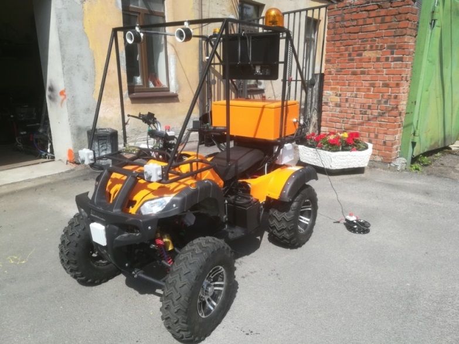

# Описание проекта Tigra (электроквадрацикл)

- [Габариты робота (все в см)](#габариты-робота-все-в-см)
- [***Примерный*** расчет масс](#примерный-расчет-масс)
- [Схемы проекта](#схемы-проекта)
- [Доки по Робокросс 2021](#доки-по-робокросс-2021)

[GitHub - lsd-maddrive/tigra-project: The project for quadro-tiger team dev](https://github.com/lsd-maddrive/tigra-project)

[LETigra start hunting (Youtube)](https://www.youtube.com/playlist?list=PLdRYu473gKJSL8_cg-hK4Fqt8hNyMvyAD)

## Габариты робота (все в см)

| Параметр                                        | Значение                               |
| ----------------------------------------------- | -------------------------------------- |
| Ширина (габарит - края колес)                   | "105 (раньше было 115, уточнить)"      |
| Длина                                           | 165 (или 185 от бампера до края компа) |
| Высота (с навесом)                              | 180                                    |
| Колесная база                                   | 124                                    |
| Диаметр колеса                                  | 50                                     |
| Ширина колеса                                   | 25                                     |
| Trackbase                                       | 105-25 (колеса) = 80                   |
| Высота тушки от пола (пол - нижняя точка тушки) | 30                                     |
| Высота тушки                                    | 85                                     |
| Высота тушки без компа                          | 60                                     |
| Ширина тушки                                    | 75                                     |

## ***Примерный*** расчет масс

- Нынешний вес всего квадрика - ~500 кг
    - Вес квадрика в сборке - 400 кг ([статья](https://awm-trade.ru/quadrocycles/vibor-q/harakteristiki-kvadrotsikla-skorost-rashod-topliva-gabarity-ves-moshhnost/#:~:text=%D0%A1%D1%80%D0%B5%D0%B4%D0%BD%D0%B8%D0%B9%20%D0%B2%D0%B5%D1%81%20%D0%BA%D0%B2%D0%B0%D0%B4%D1%80%D0%BE%D1%86%D0%B8%D0%BA%D0%BB%D0%B0%20%E2%80%94%20%D0%BE%D0%BA%D0%BE%D0%BB%D0%BE%20400,%D1%81%D1%83%D1%85%D0%B0%D1%8F%20%D0%BC%D0%B0%D1%81%D1%81%D0%B0%20%E2%80%94%20%D0%B2%D1%81%D0%B5%D0%B3%D0%BE%20347%20%D0%BA%D0%B3.)))
    - Вес аккумулятора 12 В (одной батареи) ~ 20 кг ([статья](http://avto-blogger.ru/akb-avto/skolko-vesit-akkumulyator.html))
        - Мы используем 5 штук, чтобы получить 60 В
- Вес шин в среднем 15 кг ([статья](http://kvadromanual.com/ves-reziny-dlya-kvadrocikla-tablica-po-proizvoditelyam/))
    - Пускай колеса весят порядка 20 кг в модели
- Вес тушки получается порядка 420 кг

## [Схемы проекта](Schemes.drawio)

## Доки по Робокросс 2021

- [Регламент](https://www.russianrobotics.ru/competition/robocros)

> Исходная страница: https://lavish-podium-945.notion.site/Tigra-c740280f21394deb8394ce08008f9b60
