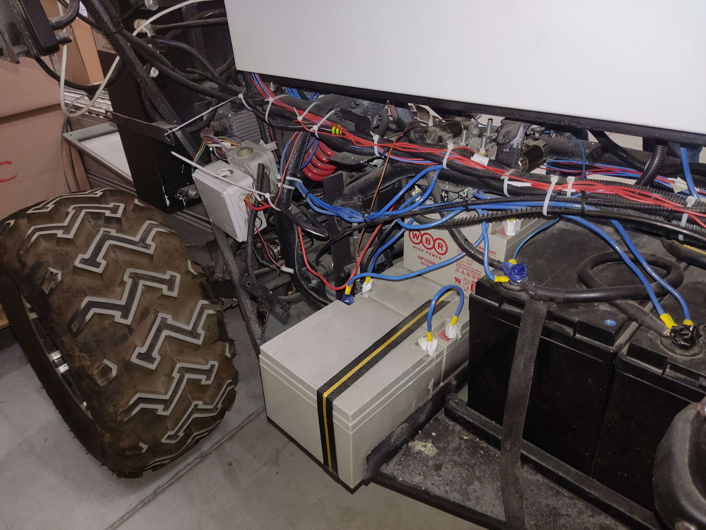
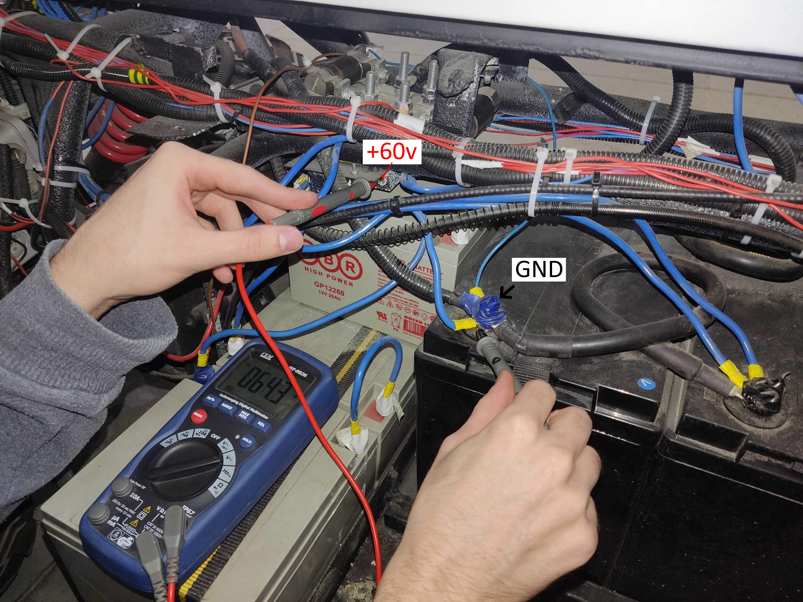

# Описание процесса заряда

## 1. Вставить предохранители при выключенном инверторе  

## 2. проверить заряд на аккумуляторах (общий должен быть не менее 50 В)  

## 3. проверить выключен ли автомат для привода (должно быть выключено при зарядке)  

## 4. включить УЗО  
## 5. включить кнопку charge  
## 6. для зарядки от сети включить автомат на 60 В при включенном питании от сети (должке загорется краный индикатор (заряжается), зеленый (заряжен))    

