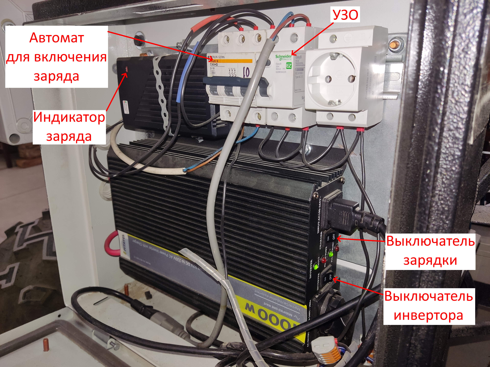

## 1. включить инвертор  
## 2. включить УЗО  
## 3. выключить автомат для зарядки 60 В  
## 4. отключить инвертор от сети  

## 5. повернуть ключ на одно положение по часовой стрелке (должна загореться зеленая лампа)  

## 6. проверить работают ли тормоза (при разжатии кнопки должен быть слышан характерный стук)  
## 7. включить автомат привода  

## 8. при установки связи с контроллером при помощи ROS загорится нижний синий индикатор (при включенном компьютере горит верняя синяя лампа) 
## 9. тигра поедет только при зажатой кнопке на поводке (отжатие кнопки экстренная остановка)  
## 10. правый стик отвечает за движение вперед/назад  
## 11. левый стик за поворот влево/вправо  
## 12. !!! следить за показателем амперметра. При зашкаливающих значениях повернуть ключ в крайнее левое положение против часовой.  

