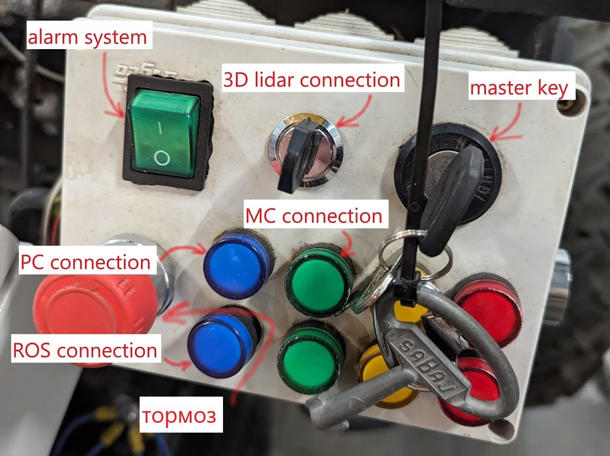

## 1. Включить инвертор  
## 2. Включить УЗО  
## 3. Выключить автомат для зарядки 60 В  
## 4. Отключить инвертор от сети  

## 5. Повернуть ключ на одно положение по часовой стрелке (должна загореться зеленая лампа)  

## 6. Проверить работают ли тормоза (при разжатии кнопки должен быть слышан характерный стук)  
## 7. Включить автомат привода  

## 8. При включенном компьютере горит верняя синяя лампа. При установке связи с контроллером при помощи ROS, загорится нижний синий индикатор. 
## 9. Тигра поедет только при зажатой кнопке на поводке (отжатие кнопки экстренная остановка)  
## 10. Правый стик отвечает за движение вперед/назад. Левый стик за поворот влево/вправо  
## 11. !!! Следить за показателем амперметра. При зашкаливающих значениях повернуть ключ в крайнее левое положение против часовой.  

