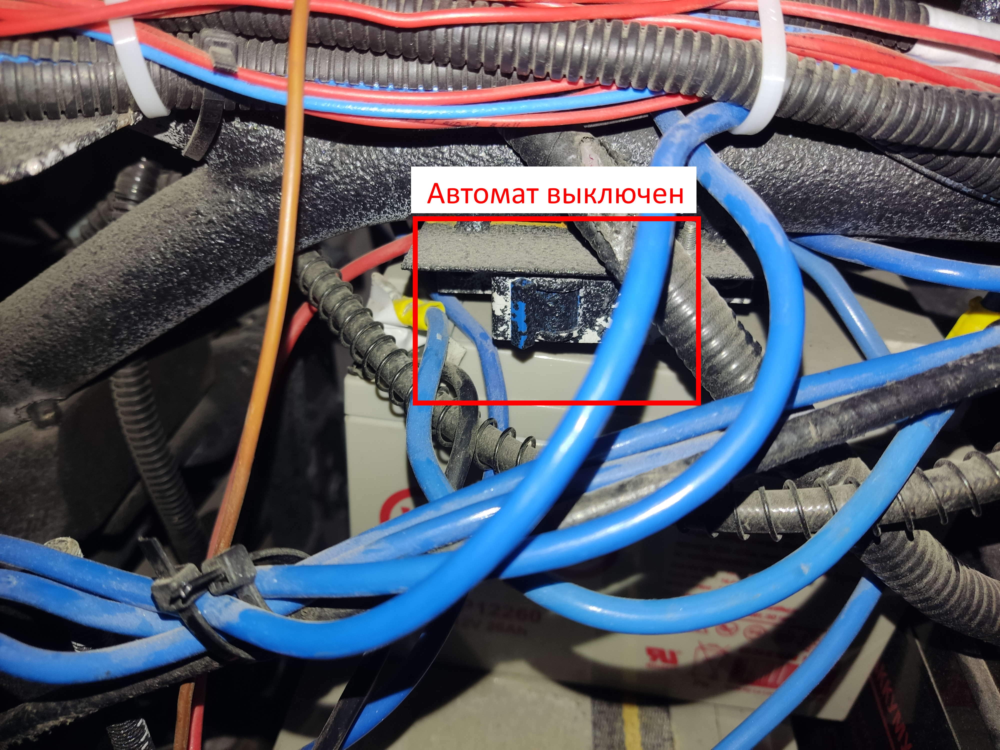

# Руководоство по катанию тигры с джойстика

## 1. Перевести в автономный режим

1. Включить инвертор

2. Включить УЗО

3. Выключить автомат для зарядки 60 В

4. Отключить инвертор от сети

    <p align=center>
        
    </p>

## 2. Подготовка к катанию

1. Повернуть правый ключ на одно положение по часовой стрелке (должна загореться зеленая лампа MC connection); отжать две красные кнопки тормоза (одна на панели, вторая на крышке компьютера); привести маленький ключ в вертикальное положение, тем самым включив 3D-лидар

    <p align=center>
        
    </p>

    <p align=center>
        
    </p>

2. Проверить работают ли тормоза (при отжатии кнопки остановки должен быть слышан характерный стук)

3. Включить автомат привода (находится с правой стороны)
    <p align=center>
        
    </p>

### 3. Катание

1. Выполнить в терминале команду

    ```bash
    roslaunch tigra_software full_start_joy_control.launch
    ```

2. При установке связи контроллера с ROS, загорится нижний синий индикатор.

3. Правый стик отвечает за движение вперед/назад. Левый стик за поворот влево/вправо. Тигра поедет только при зажатой кнопке на поводке (отжатие/отрыв кнопки приводит к эстренной остановке)